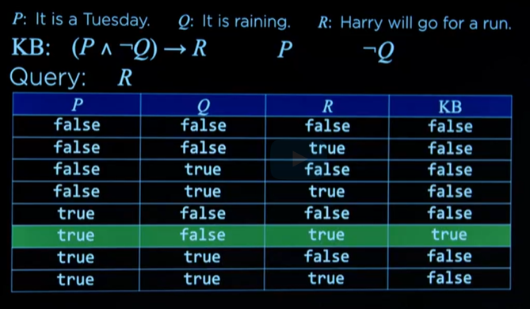

## Graph Search Algorithms
Graph Search Algorithms (e.g., BFS, DFS). Useful in robotics, pathfinding (games), recommender systems etc.
Example: maze path, google map paths, solve a word puzzle tile

Initial State: Initial state, or the current state of a puzzle
Action: a move in the puzzle, which results in another state. 
Transition Model: The result_function(stateX, action/move) => stateY
Goal Test: How does AI determine this state is the final outcome
Path Cost Function: Numerical cost associated with the given path to identify the best possible path

### Solution algorithm 
- Start with a frotier (the node or set of nodes that are being worked on in the graph) that cotains the initial state
- Start with an empty explored set (a set to keep track of what nodes have been explored already)
- Repeate:
  - if the frontier is empty, then no solution
  - remove a node from the frontier
  - if node contains goal state (i.e. target), return the solution
  - add the node to the explored set
  - expand node, add resulting nodes to the frontier if they aren't already in the frontier or the explored set

#### Possible algorithms
- Depth-first search: it goes all the way to the leaves to check the target or dead end. This may not always find the best path.
- Breath-first search: it checks the next node in all branches. it needs to explore lost of states

## Knowledge Representation

### Propositional Logic
Propositional Symbols: represents simple facts (e.g. P for "Its raining", Q for "Harry visited Hagrid"). Each symbol is either True or False.

### Logical Connectives:
- Not (¬): Inverts truth value (e.g., ¬P means "It is not raining").
- And (∧): True only if both operands are true (e.g., P ∧ Q).
- Or (∨): True if at least one operand is true (e.g., P ∨ Q).
- Implication (→): P → Q means if P is true, Q must be true; false only if P is true and Q is false.
- Biconditional (↔): P ↔ Q means P and Q are both true or both false (if and only if).

Truth Tables: Used to define the behavior of connectives by showing all possible truth value combinations.

### Knowledge Base (KB)
A set of sentences the AI knows to be true.
Example:  
_If it didn't rain, Harry visited Hagrid today. 
Harry visited Hagrid or Dumbledore today, but not both. 
Harry visited Dumbledore today._

### Inference
The process of deriving new sentences from existing ones in the knowledge base.
P: It is a Tuesday.
Q: It is raining.
R: Harry will go for a run.

**KB:**  
(P ∧ ¬Q) → R  
P  
¬Q  
Inference part of this: it’s Tuesday and not raining, so Harry will run (R)

### Model Checking
It enumerates all the possible models, and look in those possible models.

**Query:** Will Harry go for a run?

