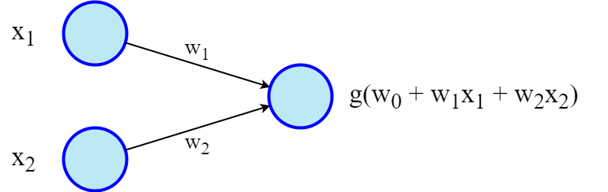

## Basics
A simple neural network consists of input units, weighted connections, and an output unit. Each unit computes a weighted sum of inputs, adds a bias, and applies an activation function (e.g., step, sigmoid, Rectified linear unit - ReLU) to determine the output.

### Training Basic Neural Network
**Gradient Descent:** Used to minimize loss by iteratively adjusting weights. It calculates the gradient (direction to reduce loss) based on all data points, updates weights, and repeats. Computationally expensive due to processing all data points.

**Limitation of Single Layer Neural Network:**
One simple layer of input and one layer of output might be useful for classification binary output (linear decision boundary). It doesnt work for complex output where data cant be linearly separable. This is when the multi-layer neural network come into play.

## Multilayer Neural Networks 
Include input, hidden, and output layers. Hidden layers allow modeling of complex, non-linearly separable functions (e.g., distinguishing points not separable by a single line).

### Training Multilayer Neural Network
**Backpropagation:** Trains multilayer networks by calculating output layer error, propagating it backward to update weights in hidden layers, using calculus to estimate errors.

**Deep Neural Networks:** Neural network with multiple hidden layers.

**Overfitting:** Overfitting in machine learning occurs when a model learns the training data too well, including its noise and irrelevant details, resulting in poor performance on new, unseen data. Essentially, the model becomes overly tailored to the training set and loses its ability to generalize to new, different data. The solution for this is to Dropout.

**Dropout:** Randomly removes units during training to prevent over-reliance on specific nodes, enhancing robustness of the model.

### Example Implementation of Neural Network: TensorFlow
It applies all the concepts above. Playground: https://playground.tensorflow.org/

## Convolutional Neural Networks (CNNs):
Designed for image processing, CNNs use:  
**Convolution:** Applies filters (e.g., 3x3 kernels) to extract features like edges, creating feature maps.  
**Pooling:** Reduces image size (e.g., max-pooling takes the maximum value in a region), making computation efficient and robust to small pixel shifts.  

**Overall Structure:** Input image → Convolution → Pooling → Flatten → Dense layers → Output.  
Example: Image classification, handwritting recognition (MNIST dataset, embedded training dataset in tensorflow) etc.

All the examples above are feed forward neural network where everything needs to put into these abstract layers: Input -> network (hidden layers) -> output

## Recurrent Neural Network (RNNs):
RNNs take input within the network, it loops back within the network. RNNs handle sequential data by feeding output back as input, maintaining state across iterations.

### Real-life Applications:
Image capturing (e.g., Microsoft CaptionBot generates text descriptions from images)  
Machine translation (e.g., Google Translate converts text sequences between languages)

**N.B.** In machine learning, both regression and classification are supervised learning techniques used for different prediction tasks. Regression predicts continuous numerical values, while classification predicts categorical labels. Essentially, regression deals with "how much" or "how many", while classification deals with "what kind" or "which category". 
