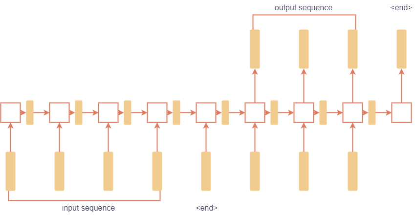

### Syntax and Semantics
**Syntax:** Rules for structuring language (e.g., valid sentence: "Sherlock Holmes stepped briskly into the room" vs. invalid: "Sherlock Holmes nine o’clock stepped briskly the room").  

**Semantics:** Meaning of sentences (e.g., "Just before nine o’clock Sherlock Holmes stepped briskly into the room" and "A few minutes before nine, Sherlock Holmes walked quickly into the room" have similar meanings).

"Colorless green ideas sleep furiously" is syntactically valid but semantically meaningless.

### Rule-Based NLP: Context-Free Grammar (CFG)
A system of rules for generating valid sentences using terminal (words) and nonterminal symbols (e.g., N for noun, V for verb).

**Example:**  
- Sentence: NP (Noun Phrase) + VP (Verb Phrase).
- NP → N | D N (e.g., "she" or "the city").
- VP → V | V NP (e.g., "walked" or "saw the city").

**Implementation:** Use NLTK (Natural Language Toolkit) to parse sentences and generate syntax trees (e.g., cfg0.py for "she walked" or "she saw the city").  

**Limitations:** Writing rules for all possible sentences is complex and labor-intensive.

### Statistical NLP: N-Grams
Contiguous sequences of n items (e.g., words) from text (e.g., trigrams: "how often have", "often have I").

**Process**  
- Tokenization: Split text into words.
- Use NLTK to extract n-grams (e.g., bigrams, trigrams) from a corpus (e.g., Sherlock Holmes stories).
- Count frequency of n-grams to understand common word sequences.
- Build Markov chains to generate text based on statistical patterns (e.g., using Shakespeare’s works in generator.py). The newly generated sentences doesn't guarantee any meaning, it follows the statistical pattern only.

### Text Classification: Naive Bayes Classifier
Classify text into categories (e.g., positive/negative sentiment for reviews).
Train on labeled data (e.g. positive or negative reviews).

### Word Representation
**One-Hot Encoding:** 
- Each word is a vector with a single 1 (e.g., "he" = [1, 0, 0, 0], "wrote" = [0, 1, 0, 0]).
- Issues: Long vectors for large vocabularies, no similarity between related words (e.g., "book" vs. "novel").

**Distributed Representation (word2vec)**
- Words represented as dense vectors (e.g., "book" = [0.12, -0.34, ...]).
- Similar words have similar vectors (e.g., "book" and "novel" are close).
- Trained on context: Words in similar contexts (e.g., "breakfast," "lunch") have similar vectors.
- Captures relationships (e.g., king - man + woman ≈ queen).

## Neural Network for NLP
### Recurrent Neural Network (RNNs)
**Encoder-Decoder Architecture**  
- Encoder encodes input sequence into a hidden state
- Decoder generates output sequence from hidden state
- Example: Translate "What is the capital of Massachusetts" to "The capital is Boston."
  
**Attention Mechanism:**  
- Allows model to focus on relevant input words when generating output (e.g., focus on "capital" and "Massachusetts" for "Boston").
- Computes attention scores to weigh importance of input words.
- Example: In translation, French "agreement" attends to English "agreement."
  
**Issue:** Hidden state struggles to capture long sequences; sequential processing limits parallelization.  

## Transformer Architecture
Replaces RNNs for parallel processing.   

**Encoder:**  
Each "input word" is passed through "Neural Network" and it outputs "encoded representation" of the word independently.
But how about tracking? In RNNs, states are tracked automatically unlike transformer architecture.
To solve this, transformer arch adds a "positional encoding" together with the "input word".
It also add addtional component before Neural Network called "Self-Attention". One or multiple "self-attention" provides context from other input words. And Self-Attention together with Neural Network could be repeated multiple times too.

**Decoder:**  
Generates output words, attending to previous output and encoded input.  

**Advantages:**  
Parallelizable, scalable for large datasets, effective for tasks like translation and chatbots.

## NLTK Tool
NLTK (Natural Language Toolkit) is not commonly used in modern large language models (LLMs) like those powering ChatGPT, Llama, or Grok 3. NLTK is a Python library designed for teaching and research, offering tools for tasks like tokenization, parsing, and n-grams. It excels in rule-based and statistical NLP but lacks the scalability and efficiency needed for training or deploying large-scale LLMs.  

Today's LLMs rely on deep learning frameworks (e.g., PyTorch, TensorFlow) and transformer architectures, which use neural networks to process massive datasets. These models learn directly from raw text, bypassing traditional NLP tools like NLTK for tasks such as tokenization or parsing.
