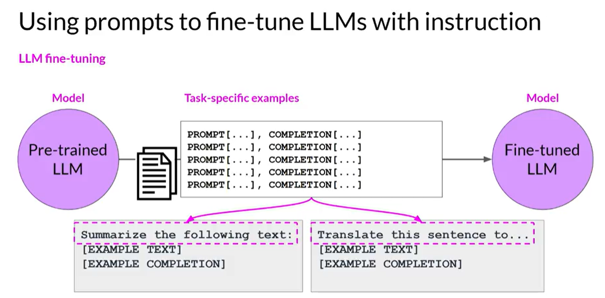

| Model Type                    | Uses                                  | Training Objective                 | Simple Example                                                     | Real-World Model Examples |
| ----------------------------- | ------------------------------------- | ---------------------------------- | ------------------------------------------------------------------ | ------------------------- |
| **Encoder-only**              | Classification (e.g., Sentiment, NER) | **Masked Language Modeling (MLM)** | Input: "The cat sat on the \[MASK]."   Target: "mat"            | BERT, RoBERTa             |
| **Decoder-only**              | Text generation, zero-shot tasks      | **Causal Language Modeling (CLM)**   Predicts next token | Input: "The cat sat on the"   Target: Predict next token: "mat" | GPT-2, GPT-3, BLOOM       |
| **Encoder-Decoder (Seq2Seq)** | Translation, Summarization, QA        | **Span Corruption**              | Input: "The cat \<x> on the \<y>."   Target: "\<x> sat \<y> mat"    | T5, BART                  |

## Training Goals

In short, the training goals are:
- Increase model size (parameters)
- Increase training data (tokens)
- Minimize token prediction loss (maximize the performance), more compute budget

But compute hardware resources and training period (time) might be constant in a real-life scenario. 

## Quick Intro to the Units
**1 petaFLOP/s:** 1,000,000,000,000,000 (one quadrillion) floating point operations per second. So 1 petaFLOP/s-day roughly requires 8 NVDIA V100 GPUs for 1 day or 2 A100 GPUs at full efficiency. 
GPT-3 (175B params) ≈ 3,700 PF/s-days.

## The Chinchilla Paper
Smaller models with more data can outperform larger models trained with too little data

| Model        | Params (B) | Tokens Trained (T) | Compute-Optimal? |
| ------------ | ---------- | ------------------ | ---------------- |
| Chinchilla   | 70         | 1.4                | ✅                |
| LLaMA        | 65         | 1.4                | ✅ (near-optimal) |
| GPT-3        | 175        | 0.3                | ❌                |
| BloombergGPT | 50         | ✓ compute-optimal  | ✅                |

## Pre-Training

Self-supervised training on large-scale unlabeled text. Teaches the model general or domain-specific language patterns by predicting missing or next tokens.
Builds the foundation for reasoning, language fluency, and factual knowledge.

Domain-specific pre-training for generative AI involves training large language models (LLMs) on specialized datasets to improve their performance in particular fields, like healthcare, finance, or law. 

BloombergGPT is an example of a domain-specific pre-trained model, trained on financial data to enhance its understanding of financial language and concepts.

## Instruction Fine-Tuning
Fine-tuning is the process of adapting a pre-trained model to a specific task or domain by training it on a smaller, task-specific dataset. It allows the model to leverage its general language understanding while specializing in the nuances of the target task.

| Feature          | **Pre-training**                            | **Fine-tuning**                                    |
| ---------------- | ------------------------------------------- | -------------------------------------------------- |
| Goal             | Learn language (general or domain-specific) | Specialize on a specific **task**                  |
| Data Type        | **Unlabeled**, large corpora                | **Labeled** prompt-completion pairs                |
| Cost & Resources | Very high (especially from scratch)         | Lower (but still needs GPUs/TPUs)                  |
| Example Use Case | Training BloombergGPT on finance documents  | Fine-tuning it for **earnings sentiment analysis** |

{: width="780" height="400" }

## Catastrophic Forgetting in Fine-Tuning
Catastrophic forgetting occurs when a model forgets previously learned information while fine-tuning for a specific tasks.

## Multitask Fine-Tuning
Multitask fine-tuning is a technique where a pre-trained model is fine-tuned on multiple tasks simultaneously. It's a way of avoiding catastrophic forgetting.

## Model Evaluation
ROUGE, BLEU, and F1 are common metrics for evaluating the performance of language models on tasks like summarization, translation, and classification.

ROUGE used for summarization whereas BLEU is used for translation tasks. F1 score is used for classification tasks.

## Model Benchmarking
Simple metrics like ROUGE and BLEU are useful for basic tasks like summarization and translation but aren't sufficient to evaluate the full capabilities of large language models (LLMs). To assess LLMs more holistically, researchers use benchmarks like **GLUE** and **SuperGLUE** for general language understanding, **MMLU** for advanced reasoning and domain knowledge, and **BIG-bench** for a wide range of tasks. The **HELM** benchmark goes further by evaluating models across multiple dimensions, including fairness, bias, and toxicity. Choosing the right benchmark and ensuring the model hasn't seen the test data is critical for meaningful evaluation.
