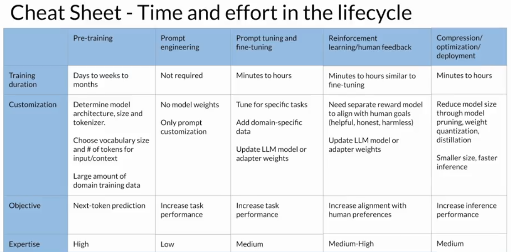

{: width="750" height="400" }

### Use Case Scope:
Define clear and narrow scope.  
- **Large Models:** Ideal for broad tasks requiring general knowledge (e.g., history, philosophy, coding).
- **Small Models:** Effective for single-task applications with comparable or optimized results.
Evaluate trade-offs between large models (100B+ parameters) for general knowledge vs. smaller models (1B or less) for specific tasks (e.g., dialogue summarization, customer service).  

### Select
Choose between off-the-shelf foundation models or pre-training custom models.

### Adapt and align model
Develop and align model to design with Prompts, fine tune and evaluate for best output. Customize models for specific datasets or tasks.

### Application integration
Optimize and deploy models for inference, build LLM powered applications

**#todo:** extend this section with sepcific example model names

