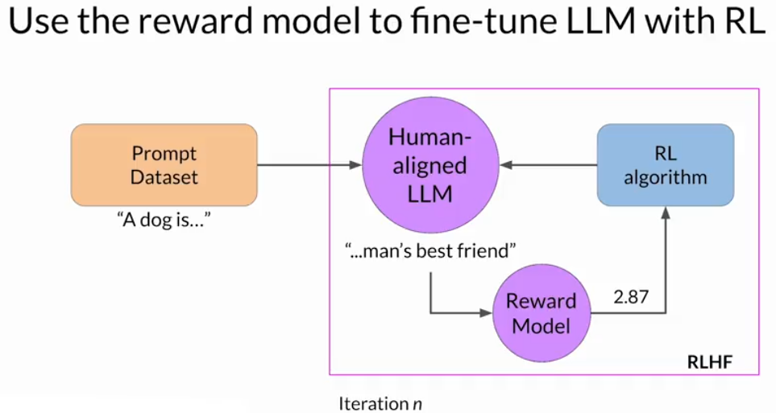

Reinforcement learning is a type of machine learning in which an agent learns to make decisions related to a specific goal by taking actions in an environment, with the objective of maximizing some notion of a cumulative reward.

The primary goal is to align an LLM with human preferences and values (e.g., helpfulness, safety, relevance)

## Key Concepts

### Instruct Model (Starting point)
A base LLM that's already fine-tuned to follow instructions using supervised learning.  
Example tasks: summarize text, answer questions, write code.  
You start RLHF from this point because it already has general capabilities.

### Reward Model (Human Preference Scorer)
A model trained to predict human preferences.
It learns from human rankings of model outputs (prompt completions) and replaces human labelers during the RL stage.

### Proximal Policy Optimization (PPO)
A reinforcement learning algorithm that updates the LLM’s weights based on the reward signals.
It ensures updates are stable and controlled, avoiding drastic changes that could harm performance.

## Process Overview
1. **Select Base Model:**  
Start with an Instruct Model (pre-trained and instruction-following). It should already perform decently on your target task.

2. **Generate Prompt-Completion Data:**  
Prepare a dataset of prompts (inputs). Use the instruct model to generate multiple completions per prompt.

3. **Human Ranking (Preference Collection):**  
Humans rank completions (e.g., from most to least helpful). Clear instructions are crucial for labelers to give consistent feedback.

4. **Convert to Pairwise Comparison:**
   - Convert ranked completions to preferred vs. non-preferred pairs.
   - Example: For completions ranked 2 > 1 > 3 → form pairs like (2,1), (2,3), (1,3).
   - Format: Preferred completion first (Yj), then less preferred (Yk).

5. **Train Reward Model:**  
Use the pairwise comparisons to train a reward model (often another LLM). It learns to assign higher scores (logits) to human-preferred completions.

6. **Run PPO Loop (Reinforcement Learning):**  
   - Generate new completions using the current version of the LLM (instruct model).
   - Score completions using the reward model.
   - Update LLM weights using PPO, optimizing for higher rewards.
   - Repeat the loop over many iterations with fresh prompts and updated weights.  

7. **Final Output:**  
A human-aligned LLM, fine-tuned to behave more helpfully, safely, or in line with specific goals (e.g., detoxified, more informative, polite, etc.)

